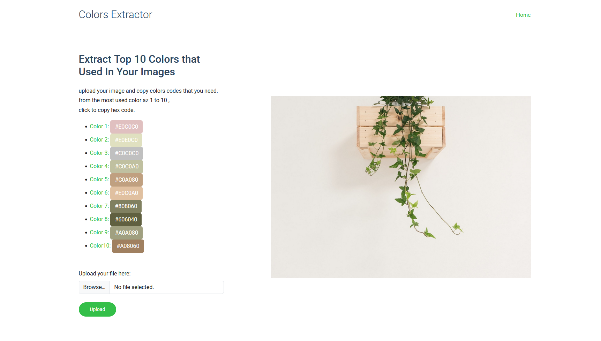

# Flask Image Color Extractor

This is a Flask web application that extracts the top 10 dominant colors from an uploaded image. The app processes the image, reduces its brightness and size for better color quantization, and then displays the most frequently occurring colors.

## Features

- Upload an image file via the web interface.
- Extract and display the top 10 most common colors in the image.
- Copy hex codes of extracted colors to the clipboard.
- Automatically removes uploaded images from the server after processing.

## Screenshot


## Installation

1. Clone the repository:

   ```sh
   git clone https://github.com/amorproje/Image-Color-Extractor-WebApp.git
   cd flask-image-color-extractor

Install dependencies:
  pip install -r requirements.txt


TODO:
    - Improve UI design with better Bootstrap styling.

    - Add support for multiple image formats.

    - Implement a color preview box next to hex codes.
